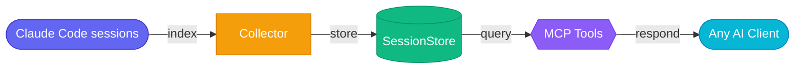

# AgentiBridge

AgentiBridge gives your AI assistants persistent memory of your Claude Code sessions. It runs as a lightweight server on your machine, indexes every session automatically, and exposes them through 11 MCP tools — so any AI client can search, summarize, and resume your past work.



---

## Quick Start

```bash
pip install agentibridge
agentibridge run
curl http://localhost:8100/health
```

Then add AgentiBridge to `~/.mcp.json`:

```json
{
  "mcpServers": {
    "agentibridge": {
      "url": "http://localhost:8100/mcp"
    }
  }
}
```

> If you set `AGENTIBRIDGE_API_KEYS`, add `"headers": {"X-API-Key": "your-key"}` to the block above.

That's it. Your Claude Code sessions are now searchable from any MCP-compatible client.

---

## CLI Commands

### Stack

| Command | What it does |
|---------|-------------|
| `agentibridge run` | Start the stack |
| `agentibridge run --rebuild` | Force pull and rebuild before starting |
| `agentibridge stop` | Stop the stack |
| `agentibridge restart` | Restart the stack |
| `agentibridge logs` | View recent logs |
| `agentibridge logs --follow` | Stream logs live |

### Status

| Command | What it does |
|---------|-------------|
| `agentibridge status` | Service health, container status, session count |
| `agentibridge version` | Print version |
| `agentibridge config` | View current configuration |
| `agentibridge config --generate-env` | Generate a `.env` template |
| `agentibridge help` | Full reference |

### Cloudflare Tunnel

| Command | What it does |
|---------|-------------|
| `agentibridge tunnel` | Show tunnel status and current URL |
| `agentibridge tunnel setup` | Interactive wizard: install, auth, DNS, config |

### Dispatch Bridge

| Command | What it does |
|---------|-------------|
| `agentibridge bridge start` | Start the host-side dispatch bridge |
| `agentibridge bridge stop` | Stop the dispatch bridge |
| `agentibridge bridge logs` | Tail dispatch bridge logs |

### Client Setup

| Command | What it does |
|---------|-------------|
| `agentibridge connect` | Print ready-to-paste configs for all clients |
| `agentibridge install --docker` | Install systemd service (Docker) |
| `agentibridge install --native` | Install systemd service (native Python) |
| `agentibridge locks` | View or clear Redis locks |

---

## MCP Tools

### Foundation

| Tool | Example use |
|------|------------|
| `list_sessions` | "Show me my recent sessions" |
| `get_session` | "Get the full transcript for session abc123" |
| `get_session_segment` | "Show me the last 20 messages from that session" |
| `get_session_actions` | "What tools did I use most in that session?" |
| `search_sessions` | "Find sessions where I worked on authentication" |
| `collect_now` | "Refresh the index now" |

### AI-Powered

| Tool | Example use |
|------|------------|
| `search_semantic` | "What were my sessions about database migrations?" |
| `generate_summary` | "Summarize what happened in session abc123" |

> Requires embeddings + LLM configured. See [Semantic Search](docs/architecture/semantic-search.md).

### Dispatch

| Tool | Example use |
|------|------------|
| `restore_session` | "Load the context from my last session on this project" |
| `dispatch_task` | "Continue that refactor task in the background" |
| `get_dispatch_job` | "What's the status of job xyz?" |

> Requires the dispatch bridge running on the host. See [Session Dispatch](docs/architecture/session-dispatch.md).

---

## Configuration

### Remote Access

| Variable | Default | Purpose |
|----------|---------|---------|
| `AGENTIBRIDGE_TRANSPORT` | `stdio` | Set to `sse` for remote clients |
| `AGENTIBRIDGE_HOST` | `127.0.0.1` | Bind address |
| `AGENTIBRIDGE_PORT` | `8100` | Listen port |
| `AGENTIBRIDGE_API_KEYS` | *(empty)* | Comma-separated API keys; empty = no auth |

### Optional Features

| Variable | Purpose |
|----------|---------|
| `POSTGRES_URL` | Enables semantic search (pgvector) |
| `LLM_API_BASE` | OpenAI-compatible embeddings/chat endpoint |
| `LLM_EMBED_MODEL` | Embedding model (e.g. `text-embedding-3-small`) |
| `LLM_CHAT_MODEL` | Chat model for summaries (e.g. `gpt-4o-mini`) |
| `ANTHROPIC_API_KEY` | Preferred for `generate_summary` (falls back to `LLM_CHAT_MODEL`) |
| `CLAUDE_DISPATCH_URL` | Bridge URL for Docker → host Claude CLI dispatch |

See [Configuration Reference](docs/reference/configuration.md) for the full list.

---

## Connect to Claude Code (same machine)

Add to `~/.mcp.json`:

```json
// No API key configured (default)
{
  "mcpServers": {
    "agentibridge": {
      "url": "http://localhost:8100/mcp"
    }
  }
}
```

```json
// With API key (if AGENTIBRIDGE_API_KEYS is set)
{
  "mcpServers": {
    "agentibridge": {
      "url": "http://localhost:8100/mcp",
      "headers": { "X-API-Key": "your-key" }
    }
  }
}
```

Run `agentibridge connect` to get ready-to-paste configs for other clients (ChatGPT, Claude Web, Grok, generic MCP).

---

## Connect to Claude.ai

Claude.ai requires a **public HTTPS URL** to reach your MCP server. The easiest way is a Cloudflare Tunnel.

**1. Set up the tunnel:**

```bash
agentibridge tunnel setup
```

**2. Choose an auth method:**

**Path A — API key** (simpler; works for all clients):

```json
{
  "mcpServers": {
    "agentibridge": {
      "url": "https://mcp.yourdomain.com/mcp",
      "headers": { "X-API-Key": "your-key" }
    }
  }
}
```

Set `AGENTIBRIDGE_API_KEYS=your-key` in your `.env` to enable key validation.

**Path B — OAuth** (Claude.ai handles the flow automatically):

No manual JSON needed. Claude.ai discovers the OAuth endpoint via `/.well-known/oauth-authorization-server` and completes the PKCE flow on its own. Set `OAUTH_ISSUER_URL` to enable it.

See [Remote Access & Auth](docs/architecture/remote-access.md) for the full env var reference.

---

## Cloudflare Tunnel

### Quick tunnel (no account needed)

Gets you a temporary `*.trycloudflare.com` URL — useful for testing, changes on restart.

```bash
docker compose --profile tunnel up -d
agentibridge tunnel    # prints the current public URL
```

### Named tunnel (your own domain)

Gets you a persistent `https://mcp.yourdomain.com` that survives restarts.

**Requires:** A [Cloudflare account](https://dash.cloudflare.com/sign-up) with a domain added.

```bash
agentibridge tunnel setup    # interactive wizard
agentibridge run
curl https://mcp.yourdomain.com/health
```

The wizard installs `cloudflared`, authenticates, creates the DNS record, and writes the config. The bridge itself has no domain config — it just listens on `localhost:8100` and the tunnel routes your domain to it.

See [Cloudflare Tunnel Guide](docs/deployment/cloudflare-tunnel.md) for full details.

---

## Developer Setup

```bash
git clone https://github.com/The-Cloud-Clock-Work/agentibridge
cp .env.example .env
docker compose up --build -d
```

See [CONTRIBUTING.md](CONTRIBUTING.md) for testing, linting, and CI details.

---

## Resources

- [Connecting Clients](docs/getting-started/connecting-clients.md) — Claude Code, ChatGPT, Claude Web, Grok setup
- [Configuration Reference](docs/reference/configuration.md) — All environment variables
- [CLI Commands](docs/reference/cli-commands.md) — Full command and flag reference
- [Semantic Search](docs/architecture/semantic-search.md) — Embedding backends and natural language search
- [Remote Access & Auth](docs/architecture/remote-access.md) — SSE/HTTP transport and API key auth
- [Session Dispatch](docs/architecture/session-dispatch.md) — Background task dispatch and context restore
- [Cloudflare Tunnel](docs/deployment/cloudflare-tunnel.md) — Expose to the internet securely
- [Reverse Proxy](docs/deployment/reverse-proxy.md) — Nginx, Caddy, and Traefik configs
- [Releases & CI/CD](docs/deployment/releases.md) — Release process and automation
- [Internal Architecture](docs/architecture/internals.md) — Key modules and design patterns
- [Contributing](CONTRIBUTING.md)

---

## License

MIT
