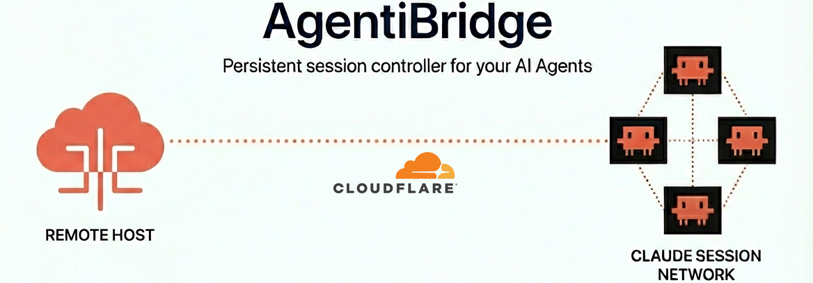

# AgentiBridge

### MCP server that indexes your Claude Code sessions — searchable, resumable, dispatchable



[](https://pypi.org/project/agentibridge/)
[](https://github.com/The-Cloud-Clock-Work/agentibridge/blob/main/LICENSE)
[](https://github.com/The-Cloud-Clock-Work/agentibridge/actions/workflows/test.yml)
[](https://hub.docker.com/r/tccw/agentibridge)
[](https://python.org)


## Why AgentiBridge?

Your Claude Code sessions disappear when the terminal closes. AgentiBridge indexes every transcript automatically and makes them searchable, resumable, and dispatchable — from any MCP client.

- 🔒 **Security-first** — OAuth 2.1 with PKCE, API key auth, Cloudflare Tunnel with zero inbound ports. Your data never leaves your infrastructure.
- 🔍 **AI-powered search** — Semantic search with pgvector embeddings. Ask natural language questions across all your past sessions.
- ⚙️ **Automatic indexing** — Background collector watches `~/.claude/projects/` and incrementally indexes new transcripts. No manual exports.
- 🌐 **Multi-client** — Works with Claude Code CLI, claude.ai, ChatGPT, Grok, and any MCP-compatible client.
- 🏠 **Fully self-hosted** — Postgres, Redis, and your data stay on your machine. No SaaS, no vendor lock-in.
- 🚀 **Background dispatch** — Fire-and-forget task dispatch with session restore. Resume work where you left off.
- ⚡ **Zero config to start** — Filesystem fallback means no Redis or Postgres required for basic use. Scale up when you need to.

---

## Quick Start

```bash
pip install agentibridge
agentibridge run
curl http://localhost:8100/health
```

Then add AgentiBridge to `~/.mcp.json`:

```json
{
  "mcpServers": {
    "agentibridge": {
      "url": "http://localhost:8100/mcp"
    }
  }
}
```

---

## Run Modes

Each mode has its own config file, auto-created from a bundled template. Both can run simultaneously.

| Mode | Command | Config | Storage |
|------|---------|--------|---------|
| **Docker** | `agentibridge run` | `~/.agentibridge/docker.env` | Redis + Postgres (bundled), `TRANSPORT=sse` |
| **Native** | `python -m agentibridge` | `~/.agentibridge/.env` | Filesystem only (default), `TRANSPORT=stdio` |

**Docker** starts 3 containers (AgentiBridge + Redis + Postgres) with sessions indexed in Redis. **Native** reads raw JSONL files from `~/.claude/projects/` on each call — no external services needed. To add Redis/Postgres in native mode, run them yourself and set `REDIS_URL` / `POSTGRES_URL` in `~/.agentibridge/.env`.

See [Configuration Reference](docs/reference/configuration.md) for all variables.

---

## CLI Commands

| Command | What it does |
|---------|-------------|
| `agentibridge run` | Start the Docker stack |
| `agentibridge run --rebuild` | Force rebuild before starting |
| `agentibridge stop` | Stop the stack |
| `agentibridge restart` | Restart the stack |
| `agentibridge logs` | View recent logs (`--follow` to stream) |
| `agentibridge status` | Health, containers, session count |
| `agentibridge version` | Print version |
| `agentibridge update` | Updates agentibridge |
| `agentibridge config` | View current config |
| `agentibridge connect` | Ready-to-paste client configs |
| `agentibridge tunnel` | Tunnel status and URL |
| `agentibridge tunnel setup` | Interactive tunnel wizard |
| `agentibridge help` | Full reference |

See [CLI Reference](docs/reference/cli-commands.md) for all commands and flags.

---

## MCP Tools

| Tool | Example use |
|------|------------|
| `list_sessions` | "Show me my recent sessions" |
| `get_session` | "Get the full transcript for session abc123" |
| `get_session_segment` | "Show me the last 20 messages from that session" |
| `get_session_actions` | "What tools did I use most in that session?" |
| `search_sessions` | "Find sessions where I worked on authentication" |
| `collect_now` | "Refresh the index now" |
| `search_semantic` | "What were my sessions about database migrations?" |
| `generate_summary` | "Summarize what happened in session abc123" |
| `restore_session` | "Load the context from my last session on this project" |
| `dispatch_task` | "Continue that refactor task in the background" |
| `get_dispatch_job` | "What's the status of job xyz?" |
| `list_memory_files` | "What memory files exist across my projects?" |
| `get_memory_file` | "Show me the MEMORY.md for the antoncore project" |
| `list_plans` | "What plans have I created recently?" |
| `get_plan` | "Show me the plan called moonlit-rolling-reddy" |
| `search_history` | "Find prompts where I mentioned docker" |

> **Note:** `search_semantic` and `generate_summary` require embeddings + LLM — see [Semantic Search](docs/architecture/semantic-search.md). `dispatch_task` and `restore_session` require the dispatch bridge — see [Session Dispatch](docs/architecture/session-dispatch.md). Knowledge catalog tools (`list_memory_files`, `get_memory_file`, `list_plans`, `get_plan`, `search_history`) expose Claude Code's memory files, plans, and prompt history.

---

## Configuration

Config files are auto-created from bundled templates:
- **Docker:** `~/.agentibridge/docker.env` (created on first `agentibridge run`)
- **Native:** `~/.agentibridge/.env` (created on first `import agentibridge`)

Run `agentibridge config` to view current values. See [Configuration Reference](docs/reference/configuration.md) for all environment variables.

---

## MCP Configuration

AgentiBridge supports two connection modes: **local** (stdio, zero-config) and **remote** (HTTP with API key auth). Use one or both depending on your setup.

### Option A — Local (stdio)

Runs AgentiBridge as a subprocess alongside Claude Code. No server to manage, no auth needed. Best for single-machine use.

```bash
pip install agentibridge
```

Configuration is auto-loaded from `~/.agentibridge/.env` (created on first run). Edit it to customize settings.

Add to your project `.mcp.json` or `~/.mcp.json`:

```json
{
  "mcpServers": {
    "agentibridge": {
      "command": "python",
      "args": ["-m", "agentibridge"]
    }
  }
}
```

### Option B — Remote (HTTP + API key)

Runs AgentiBridge as a persistent server — access your sessions from any device or MCP client over the network. Requires `AGENTIBRIDGE_API_KEYS` set on the server.

```json
{
  "mcpServers": {
    "agentibridge": {
      "type": "http",
      "url": "https://bridge.yourdomain.com/mcp",
      "headers": {
        "X-API-Key": "sk-ab-your-api-key-here"
      }
    }
  }
}
```

Run `agentibridge connect` to get ready-to-paste configs for other clients (ChatGPT, Claude Web, Grok, generic MCP).

---

## Connect to Claude.ai

Claude.ai requires **OAuth 2.1** to connect to remote MCP servers. AgentiBridge has a built-in OAuth 2.1 authorization server with PKCE — just enable it with one env var.

**1. Enable OAuth on your server:**

Add to `~/.agentibridge/.env` (auto-created on first run — see [Configuration](#configuration)):

```bash
# Required — enables OAuth 2.1
OAUTH_ISSUER_URL=https://bridge.yourdomain.com

# Optional — lock to a single client (recommended for production)
OAUTH_CLIENT_ID=my-bridge-client
OAUTH_CLIENT_SECRET=generate-a-strong-secret-here
OAUTH_ALLOWED_REDIRECT_URIS=https://claude.ai/api/mcp/auth_callback
OAUTH_ALLOWED_SCOPES=claudeai
```

**2. Expose your server over HTTPS:**

```bash
agentibridge tunnel setup    # Cloudflare Tunnel (easiest)
# or use your own reverse proxy (nginx, Caddy, etc.)
```

**3. Add to claude.ai:**

Go to [claude.ai/settings/connectors](https://claude.ai/settings/connectors), add your server URL:

```
https://bridge.yourdomain.com/mcp
```

Claude.ai will automatically:
1. Discover OAuth metadata at `/.well-known/oauth-authorization-server`
2. Register as a client (or use your pre-configured credentials)
3. Complete the PKCE authorization flow
4. Store the access token and refresh it automatically

No manual JSON config needed — claude.ai handles the entire OAuth flow.

**4. Verify OAuth is working:**

```bash
curl https://bridge.yourdomain.com/.well-known/oauth-authorization-server
curl https://bridge.yourdomain.com/health
```

> API key auth (`X-API-Key` header) continues to work alongside OAuth. Both auth methods are active simultaneously.

See [Remote Access & Auth](docs/architecture/remote-access.md) for the full reference.

---

## Cloudflare Tunnel

### Quick tunnel (no account needed)

Gets you a temporary `*.trycloudflare.com` URL — useful for testing, changes on restart.

```bash
docker compose --profile tunnel up -d
agentibridge tunnel    # prints the current public URL
```

### Named tunnel (your own domain)

Gets you a persistent `https://mcp.yourdomain.com` that survives restarts.

**Requires:** A [Cloudflare account](https://dash.cloudflare.com/sign-up) with a domain added.

```bash
agentibridge tunnel setup    # interactive wizard
agentibridge run
curl https://mcp.yourdomain.com/health
```

The wizard installs `cloudflared`, authenticates, creates the DNS record, and writes the config. The bridge itself has no domain config — it just listens on `localhost:8100` and the tunnel routes your domain to it.

The wizard writes `CLOUDFLARE_TUNNEL_TOKEN` into `~/.agentibridge/docker.env` automatically. This token authenticates the `cloudflared` container to your Cloudflare tunnel — it's static, so it works permanently across restarts, reboots, and redeployments. It only changes if you delete and recreate the tunnel in the Cloudflare Zero Trust dashboard.

See [Cloudflare Tunnel Guide](docs/deployment/cloudflare-tunnel.md) for full details.

---

## Developer Setup

```bash
git clone https://github.com/The-Cloud-Clock-Work/agentibridge
cp .env.example .env
docker compose up --build -d
```

See [CONTRIBUTING.md](CONTRIBUTING.md) for testing, linting, and CI details.

---

## Resources

- [Connecting Clients](docs/getting-started/connecting-clients.md) — Claude Code, ChatGPT, Claude Web, Grok setup
- [Configuration Reference](docs/reference/configuration.md) — All environment variables
- [CLI Commands](docs/reference/cli-commands.md) — Full command and flag reference
- [Semantic Search](docs/architecture/semantic-search.md) — Embedding backends and natural language search
- [Remote Access & Auth](docs/architecture/remote-access.md) — SSE/HTTP transport and API key auth
- [Session Dispatch](docs/architecture/session-dispatch.md) — Background task dispatch and context restore
- [Cloudflare Tunnel](docs/deployment/cloudflare-tunnel.md) — Expose to the internet securely
- [Reverse Proxy](docs/deployment/reverse-proxy.md) — Nginx, Caddy, and Traefik configs
- [Releases & CI/CD](docs/deployment/releases.md) — Release process and automation
- [Internal Architecture](docs/architecture/internals.md) — Key modules and design patterns
- [Knowledge Catalog](docs/architecture/knowledge-catalog.md) — Memory files, plans, and prompt history
- [Contributing](CONTRIBUTING.md)

---

## FAQ

**Isn't this just session history?**

History is the data layer. The product is remote fleet control — dispatch tasks from your phone, search sessions from any MCP client, monitor jobs from claude.ai. You go from 0% productivity away from your desk to controlling your agents from anywhere.

**VS Code / Cursor already has conversation history.**

IDE history is local to that IDE. AgentiBridge adds remote multi-client access, background dispatch from any device, and semantic search across your full session history. Leave your desk and dispatch a background task from your phone — your IDE can't do that.

**Won't Anthropic build this natively?**

AgentiBridge is self-hosted, vendor-neutral infrastructure. Native features optimize for one vendor's client. AgentiBridge works with Claude Code, claude.ai, ChatGPT, Grok, and any MCP client. Your data stays on your machine, and you control the storage backend, embedding model, and access policies. MIT licensed — no lock-in.

**Do I need Redis and Postgres?**

Not for basic use. `agentibridge run` bundles Redis and Postgres automatically via Docker — no setup needed. If you run natively (`python -m agentibridge`), it works without either — sessions are read directly from `~/.claude/projects/` JSONL files on each call. This is slower but has zero dependencies. To add Redis or Postgres in native mode, run them yourself and set `REDIS_URL` / `POSTGRES_URL` in `~/.agentibridge/.env`.

**Is my data sent anywhere?**

No. No telemetry, no SaaS dependencies. Cloudflare Tunnel is opt-in, and even then only MCP tool responses traverse the tunnel — your transcripts stay local.

**Which clients are supported?**

Claude Code CLI, claude.ai, ChatGPT, Grok, and any MCP-compatible client. Run `agentibridge connect` for ready-to-paste configs.

---

## Code Quality

This project is continuously analyzed by [SonarQube](https://sonar.homeofanton.com/dashboard?id=agentibridge) for code quality, security vulnerabilities, and test coverage.

## License

MIT
