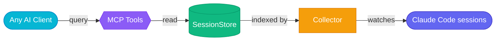

# Your AI agents don't sleep. Now neither does their memory.
{: .fs-9 .fw-700 .text-center .mb-4 }

Step away from your desk and productivity drops to zero. AgentiBridge makes your Claude Code sessions persistent, searchable, and remotely controllable — from any MCP client.
{: .fs-5 .text-center .text-grey-dk-100 .mb-6 }

{: .d-block .mx-auto .mb-6 }

<div class="hero-actions text-center mb-8" markdown="0">
  <a href="#quick-start" class="btn btn-primary fs-5 mr-2">Get Started</a>
  <a href="https://github.com/The-Cloud-Clock-Work/agentibridge" class="btn fs-5" target="_blank">View on GitHub</a>
</div>

[](https://pypi.org/project/agentibridge/)
[](https://github.com/The-Cloud-Clock-Work/agentibridge/blob/main/LICENSE)
[](https://github.com/The-Cloud-Clock-Work/agentibridge/actions/workflows/test.yml)
[](https://hub.docker.com/r/tccw/agentibridge)
[](https://python.org)
{: .text-center .mb-8 }

---

## The Problem

Your Claude Code sessions disappear when the terminal closes. Your IDE history is locked to one machine. When you leave your desk, your agent productivity drops to zero.

**AgentiBridge fixes this.**

It indexes every Claude Code transcript automatically, makes them searchable with AI-powered semantic search, and lets you dispatch and monitor tasks from any device — your phone, another laptop, or claude.ai.

---

## Features

<div class="feature-grid">
  <div class="feature-card">
    
    <h3>Semantic Search</h3>
    <p>Ask natural language questions across all your past sessions. Powered by pgvector embeddings — no keyword matching needed.</p>
  </div>
  <div class="feature-card">
    
    <h3>Background Dispatch</h3>
    <p>Fire-and-forget task dispatch with session restore. Resume work where you left off, from any device.</p>
  </div>
  <div class="feature-card">
    
    <h3>Security First</h3>
    <p>OAuth 2.1 with PKCE, API key auth, Cloudflare Tunnel. Fully self-hosted — your data never leaves your infrastructure.</p>
  </div>
  <div class="feature-card">
    
    <h3>Multi-Client Fleet</h3>
    <p>Works with Claude Code CLI, claude.ai, ChatGPT, Grok, and any MCP-compatible client. One server, all your clients.</p>
  </div>
</div>

---

## Quick Start
{: #quick-start }

```bash
pip install agentibridge
agentibridge run
curl http://localhost:8100/health
```

Add to your MCP config (`~/.mcp.json`):

```json
{
  "mcpServers": {
    "agentibridge": {
      "url": "http://localhost:8100/mcp"
    }
  }
}
```

That's it. Your Claude Code sessions are now searchable from any MCP-compatible client.

{: .note }
> Zero dependencies to start — filesystem-only storage out of the box. Add Redis for caching and Postgres for semantic search when you need them.

---

## 16 MCP Tools

### Foundation

| Tool | What it does |
|:-----|:-------------|
| `list_sessions` | List sessions across all projects |
| `get_session` | Full session metadata + transcript |
| `get_session_segment` | Paginated/time-range transcript retrieval |
| `get_session_actions` | Extract tool calls with counts |
| `search_sessions` | Keyword search across transcripts |
| `collect_now` | Trigger immediate collection |

### AI-Powered

| Tool | What it does |
|:-----|:-------------|
| `search_semantic` | Semantic search using embeddings |
| `generate_summary` | Auto-generate session summary via LLM |

### Dispatch

| Tool | What it does |
|:-----|:-------------|
| `restore_session` | Load session context for continuation |
| `dispatch_task` | Fire-and-forget background job dispatch |
| `get_dispatch_job` | Poll a background job for status and output |

### Knowledge Catalog

| Tool | What it does |
|:-----|:-------------|
| `list_memory_files` | List memory files across projects |
| `get_memory_file` | Read a specific memory file |
| `list_plans` | List plans sorted by recency |
| `get_plan` | Read a plan by codename |
| `search_history` | Search the global prompt history |

---

## Architecture



---

## Deployment Options

| | Minimal | Standard | Production |
|:--|:--------|:---------|:-----------|
| **Install** | `pip install agentibridge` | `docker compose up -d` | Docker + Cloudflare Tunnel |
| **Storage** | Filesystem only | Redis + filesystem | Redis + Postgres (pgvector) |
| **Search** | Keyword only | Keyword only | Keyword + semantic |
| **Access** | Local only | Local network | Internet (HTTPS) |
| **Auth** | None | API key | OAuth 2.1 + API key |
| **Dispatch** | N/A | Local bridge | Remote bridge |

---

## FAQ

<details markdown="block">
<summary><strong>Isn't this just session history?</strong></summary>

History is the data layer. The product is remote fleet control — dispatch tasks from your phone, search sessions from any MCP client, monitor jobs from claude.ai. You go from 0% productivity away from your desk to controlling your agents from anywhere.
</details>

<details markdown="block">
<summary><strong>VS Code / Cursor already has conversation history.</strong></summary>

IDE conversation history is excellent for local replay within that IDE. AgentiBridge serves CLI-first developers and adds capabilities no IDE provides: remote multi-client access, background dispatch from any device, and semantic search across your full session history.
</details>

<details markdown="block">
<summary><strong>Won't Anthropic build this natively?</strong></summary>

AgentiBridge is self-hosted, vendor-neutral infrastructure. Native features optimize for one vendor's client. AgentiBridge works with Claude Code, claude.ai, ChatGPT, Grok, and any MCP client. Your data stays on your machine. MIT licensed — no lock-in.
</details>

<details markdown="block">
<summary><strong>Do I need Redis and Postgres?</strong></summary>

No. `pip install agentibridge && agentibridge run` works with zero dependencies — filesystem-only storage out of the box. Add Redis for caching and Postgres for semantic search when you need them.
</details>

<details markdown="block">
<summary><strong>Is my data sent anywhere?</strong></summary>

No. No telemetry, no SaaS dependencies. Cloudflare Tunnel is opt-in, and even then only MCP tool responses traverse the tunnel — your transcripts stay local.
</details>

<details markdown="block">
<summary><strong>Which clients are supported?</strong></summary>

Claude Code CLI, claude.ai, ChatGPT, Grok, and any MCP-compatible client. Run `agentibridge connect` for ready-to-paste configs.
</details>

---

<div class="text-center mb-4" markdown="0">
  <p class="fs-5 fw-500">Ready to make your AI agents persistent?</p>
  <code class="fs-4">pip install agentibridge</code>
</div>

[Get Started](docs/getting-started/connecting-clients){: .btn .btn-primary .fs-5 .mr-2 }
[Documentation](docs/){: .btn .fs-5 .mr-2 }
[View on GitHub](https://github.com/The-Cloud-Clock-Work/agentibridge){: .btn .fs-5 }
{: .text-center }
